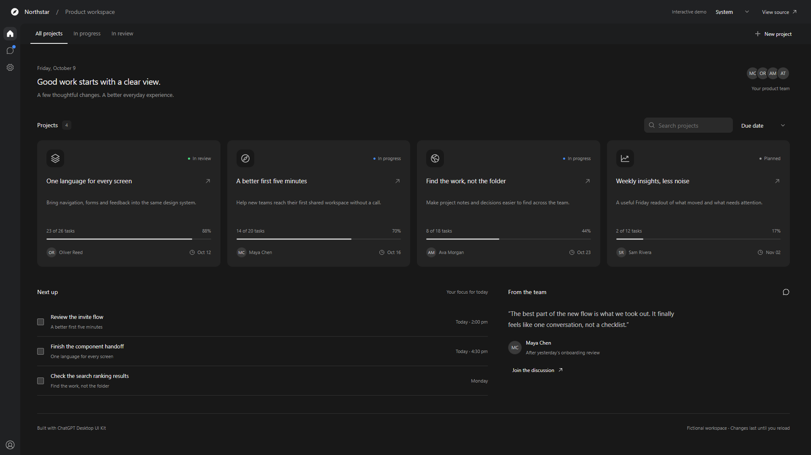
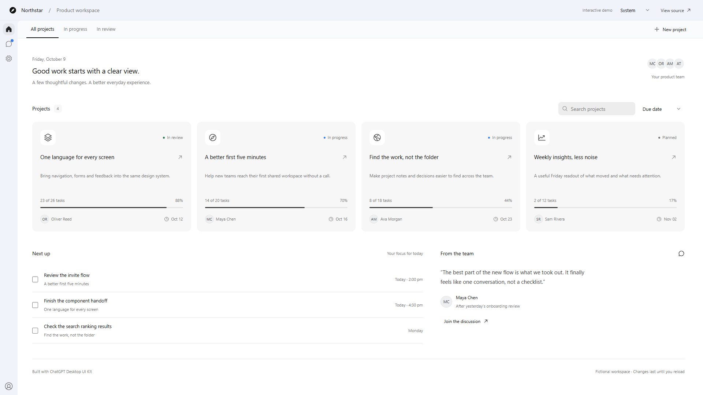

# ChatGPT Desktop UI Kit

An independent React component library for neutral desktop interfaces. It provides shared controls, semantic themes, compact navigation, layout primitives, synthetic visual examples and a companion agent Skill. It is not affiliated with OpenAI.

## Try the demo

[Open the interactive demo](https://liuminxin45.github.io/ChatGPT-Desktop-UI/) — an English product workspace with projects, a team inbox and settings. Search and filter projects, create one, complete a task, send a message, and switch between light and dark themes.





All people, projects and conversations are fictional and written for this example. Edits stay in memory and reset on reload. Only the theme preference is stored in the browser. The demo has no backend, authentication, analytics or external data calls.

To run it locally with Node **24.19.0**:

```sh
npm ci --ignore-scripts
npm run demo
```

Open **http://127.0.0.1:4173**. If the port is occupied, set `PORT` to a free port. `npm run demo:build` exports a static site to `examples/demo/build/`; it can be served by any static web server. GitHub Actions builds and publishes that folder to GitHub Pages on a push to `main`.

React does not require Electron or Tauri. The build compiles the actual library components into browser JavaScript, and the generated HTML loads that bundle. The existing `npm run gallery` remains a separate component and interaction reference.

See [Demo verification](docs/demo/README.md) for screenshots and test scope.

## Development

Use Node **24.19.0**.

```sh
npm ci --ignore-scripts
npm run typecheck
npm run build
npm test
npm run demo:build
npm run test:demo
npm run audit:public
npm run skill:package
npm run skill:check
```

`npm run gallery` serves the synthetic examples on loopback. Visual tests use installed Microsoft Edge; set `UI_BROWSER_CHANNEL=chrome` for Chrome or `chromium` for an installed Playwright browser. Tests do not use business accounts or production data.

## Integration

PHD, Collector and Processor consume this repository at the same immutable Git revision. PHD retains `@phd/ui` and `@phd/icons` as compatibility exports and Host adapters. Collector and Processor import this package directly. Consumers must not maintain copied control implementations or generated vendor snapshots.

Install from a Git URL pinned to a full commit hash, or an explicitly versioned package archive. Git installation runs `prepare` to produce the distribution. A local `file:` dependency is suitable for development, not a release pin. See [Integration](docs/INTEGRATION.md) for stylesheet and Host ownership.

```tsx
import { DesktopRoot, Button, Select, WorkbenchPage } from '@phd/chatgpt-desktop-kit';
import '@phd/chatgpt-desktop-kit/styles.css';

export function App({ sort, setSort, createProject }) {
  return <DesktopRoot storageKey="example.theme">
    <WorkbenchPage>
      <Button actionId="project.create" onClick={createProject}>New project</Button>
      <Select aria-label="Sort" actionId="project.sort" value={sort}
        options={[{ value: 'recent', label: 'Recent' }, { value: 'name', label: 'Name' }]}
        onValueChange={setSort} />
    </WorkbenchPage>
  </DesktopRoot>;
}
```

Buttons default to `type="button"`; form submission requires `type="submit"`. Embedded surfaces inherit their Host's stylesheet, theme and window controls.

## Documentation

- [Design system](docs/DESIGN_SYSTEM.md): geometry, tokens and component states.
- [Design guidance](docs/DESIGN_GUIDANCE.md): route auditing and visual adaptation.
- [Integration](docs/INTEGRATION.md): exports, localization and Host boundaries.
- [Visual examples](docs/VISUAL_REFERENCES.md): synthetic screenshots.
- [Validation](docs/VALIDATION.md): executable checks and scope.
- [AGENTS.md](AGENTS.md): repository implementation contract.

## Source and distribution

`src/` is the implementation authority. `compat/` preserves compound Radix APIs used by existing consumers; both APIs share the same semantic styles and tokens. `docs/provenance.json` records extraction origins. The historical `phd-*` namespace does not require a PHD service.

`dist/`, Skill assets and copied Skill references are generated and excluded from Git. Edit source and canonical documentation, then run `npm run build && npm run skill:package`. `npm run skill:install` installs the generated Skill locally and verifies ownership before replacing an existing installation.

Source and synthetic examples use the [MIT license](LICENSE). Include [NOTICE.md](NOTICE.md) and generated third-party notices when redistributing. No package publication or remote push is performed by the build scripts.
