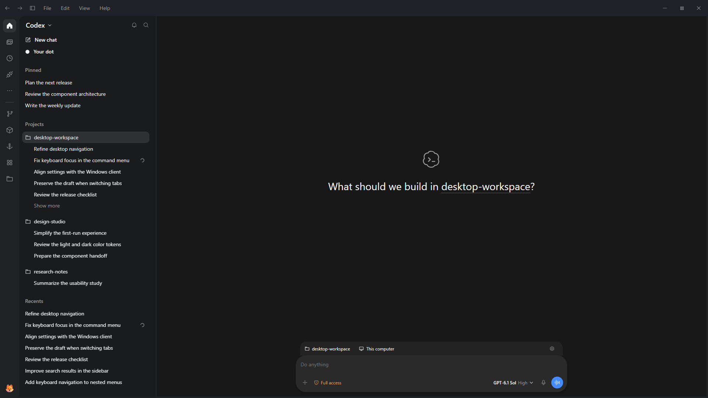
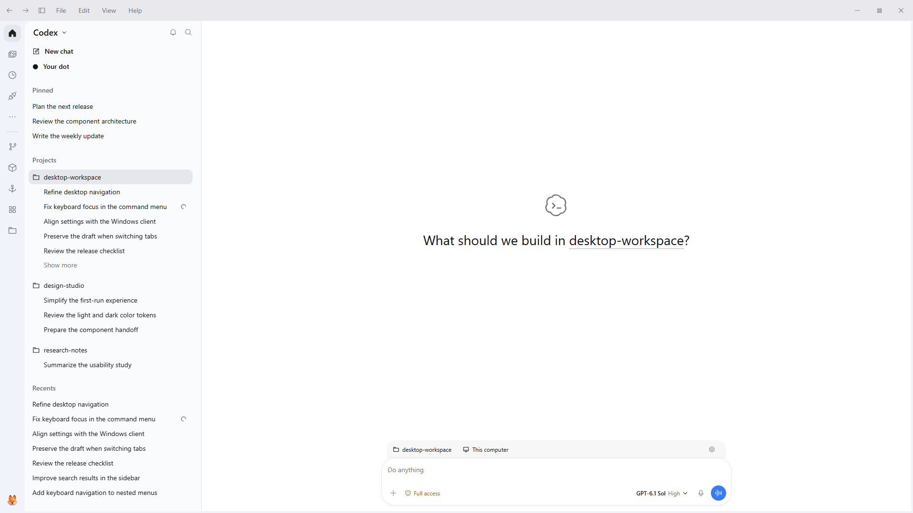

# ChatGPT Desktop UI Kit

An independent React component library for neutral desktop interfaces. It provides shared controls, semantic themes, compact navigation, layout primitives, synthetic visual examples and a companion agent Skill. It is not affiliated with OpenAI.

## Try the demo

[Open the demo](https://liuminxin45.github.io/ChatGPT-Desktop-UI/) — a browser recreation of the Windows **ChatGPT 26.1002.7124.0** client, with synthetic English content. It follows the observed project/chat sidebar, composer, menus, search, new-tab surface and grouped Settings. Create projects, rename and pin chats, explore nested menus, preserve drafts, use navigation history and switch themes.





All people, projects and conversations are fictional. Edits stay in memory and reset on reload. Only the theme preference is stored in the browser. Native files, accounts, terminals, microphones and AI services are simulated or unavailable. Reference screenshots containing private content are not redistributed. See [client alignment](docs/CLIENT_ALIGNMENT.json) for version evidence, measured geometry and fidelity limits.

To run it locally with Node **24.19.0**:

```sh
npm ci --ignore-scripts
npm run demo
```

Open **http://127.0.0.1:4173**. If the port is occupied, set `PORT` to a free port. `npm run demo:build` exports a static site to `examples/demo/build/`; it can be served by any static web server. GitHub Actions builds and publishes that folder to GitHub Pages on a push to `main`.

React does not require Electron or Tauri. The build compiles the actual library components into browser JavaScript, and the generated HTML loads that bundle. The existing `npm run gallery` remains a separate component and interaction reference.

See [Demo verification](docs/demo/README.md) for screenshots and test scope.

## Development

Use Node **24.19.0**.

```sh
npm ci --ignore-scripts
npm run typecheck
npm run build
npm test
npm run demo:build
npm run test:demo
npm run audit:public
npm run skill:package
npm run skill:check
```

`npm run gallery` serves the synthetic examples on loopback. Visual tests use installed Microsoft Edge; set `UI_BROWSER_CHANNEL=chrome` for Chrome or `chromium` for an installed Playwright browser. Tests do not use business accounts or production data.

## Integration

Related clients consume this repository at the same immutable Git revision. Existing application imports may remain as compatibility exports and Host adapters. Consumers must not maintain copied control implementations or generated vendor snapshots.

Install from a Git URL pinned to a full commit hash, or an explicitly versioned package archive. Git installation runs `prepare` to produce the distribution. A local `file:` dependency is suitable for development, not a release pin. See [Integration](docs/INTEGRATION.md) for stylesheet and Host ownership.

Release consumers use `git+https://github.com/liuminxin45/ChatGPT-Desktop-UI.git#<full-commit>` and run normal installation with scripts enabled. `node node_modules/chatgpt-desktop-kit/dist/check-consumer.mjs` verifies the public source, lockfiles, actual installed revision, prepared distribution and declared forwarding adapters. One immutable revision is shared by all clients; no local Git path or vendor snapshot is required.

```tsx
import { DesktopRoot, Button, Select, WorkbenchPage } from 'chatgpt-desktop-kit';
import 'chatgpt-desktop-kit/styles.css';

export function App({ sort, setSort, createProject }) {
  return <DesktopRoot storageKey="example.theme">
    <WorkbenchPage>
      <Button actionId="project.create" onClick={createProject}>New project</Button>
      <Select aria-label="Sort" actionId="project.sort" value={sort}
        options={[{ value: 'recent', label: 'Recent' }, { value: 'name', label: 'Name' }]}
        onValueChange={setSort} />
    </WorkbenchPage>
  </DesktopRoot>;
}
```

Buttons default to `type="button"`; form submission requires `type="submit"`. Embedded surfaces inherit their Host's stylesheet, theme and window controls.

## Documentation

- [Design system](docs/DESIGN_SYSTEM.md): geometry, tokens and component states.
- [Component map](docs/COMPONENTS.md): public API and Host ownership.
- [Recreation contract](docs/REPLICA_CONTRACT.md): reference priority, surface inventory and acceptance gaps.
- [Design guidance](docs/DESIGN_GUIDANCE.md): route auditing and visual adaptation.
- [Integration](docs/INTEGRATION.md): exports, localization and Host boundaries.
- [Visual examples](docs/VISUAL_REFERENCES.md): synthetic screenshots.
- [Validation](docs/VALIDATION.md): executable checks and scope.
- [AGENTS.md](AGENTS.md): repository implementation contract.

## Source and distribution

`src/` is the implementation authority. `compat/` preserves compound Radix APIs used by existing consumers; both APIs share the same semantic styles and tokens. `docs/provenance.json` records anonymized extraction origins. The `desktop-*` namespace has no application service dependency.

`dist/`, Skill assets and copied Skill references are generated and excluded from Git. Edit source and canonical documentation, then run `npm run build && npm run skill:package`. `npm run skill:install` installs the generated Skill locally and verifies ownership before replacing an existing installation.

Source and synthetic examples use the [MIT license](LICENSE). Include [NOTICE.md](NOTICE.md) and generated third-party notices when redistributing. No package publication or remote push is performed by the build scripts.
